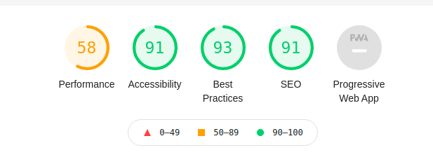

# Earth Blox Drone Supplier Registration

A full-stack demonstration application consisting of a `Vue.js` UI, a `django` middleware and a `postgres/postgis` database. The stack also include a [pgbouncer](https://www.pgbouncer.org/) instance for postgres connecion pooling and a [Redis](https://redis.io/) instance for http caching. A [MailHog](https://github.com/mailhog/MailHog) instance is also included in the stack to facilitate email testing, but is not used for the current demo.

## Development

Install [Docker](https://docs.docker.com/install/) and [Docker-Compose](https://docs.docker.com/compose/).

To checkout the code run `git clone git@github.com:bjohare/earthblox.git`

To build and run a local instance of the stack do (from the local repo root):

`docker-compose -f local.yml up --build`

It will take a while to pull the docker containers and build the frontend. Once built the application will available at http://localhost:8000.

## Users

Two users are created by default. A admin (superuser) with login `admin@admin.com` password `admin`, and a demo user with a login of `demo@demo.com` password `demo`. Use the `demo` user for tesing. Once the app has built and is running, login with the demo user account on the front page. A successful login redirects to the supplier registration page at http://localhost:8000/register.

## Code Structure

The structure of the codebase should be reasonably self-explanatory. The backend `folder` contains all the code for the django deployment. The `frontend` contains all the VueJS frontend code. The `nginx` folder holds configuration for an instance of Nginx running in a docker container and which acts as a proxy for both the frontend and backend docker containers. The code of interest for the backend is at `backend/apps/suppliers`.

### API Endpoints

The backend code defines an API endpoint for Supplier registrations. This endpoint accepts a JSON request body with the supplier details and returns the supplier info including an database generated id. This registration endpoint is at http://localhost:8000/api/suppliers/register/. A further API endpoint provides a list of countries for use in the frontend registration form. This is available at http://localhost:8000/api/suppliers/countries/. Both endpoints require an authenticated user for access. The application uses session-based authentication.

### UI

The code of interest for the frontend is at `frontend/src`. This consists of main application views at `frontend/src/views`. The views are loaded into a main application container at `frontend/src/containers/Main.vue` and are hooked into `vue-router` using route definitions in `frontend/src/routes/index.js`. Application state is managed by `vuex` in the `frontend/src/store/` folder. Custom components for the registration form are defined in `frontend/src/components` which includes a mixin for reusable form validation. The `CountrySelector.vue` and `DataSelector.vue` files define custom form components based on the `vue-multiselect` library. UI dependencies are declared in `frontend/package.json` and are installed at build time.

### Registration

The registration form is Vue Single Page Component defined in `frontend/src/views/suppliers/Register.vue`. This uses [Bootstrap-Vue](https://bootstrap-vue.org/) to provide responsive, accessible Vue form components.

## Lighthouse Report

The following scores were achieved using the Chrome Lighthouse reporting tool. An improved performance score could be acheived (given more time) by lazy-loading Vue components, by configuring caching for static assets and by tweaking the webpack bundler to split the code into smaller chunks.

## Testing

The backend code is tested to 100% code coverage. Backend tests can be run by doing `./runtests` from a terminal. By default all tests are run. To run an individual test class, eg API tests do `./runtests apps/suppliers/tests/test_api.py::RegisterSupplierAPIViewTest`. To generate a coverage report on the console, first run all tests `./runtests`, then run `./coverage`.

## Deployment

There is no deploymet configuation. However there are numerous options for scalable deployment. The frontend builds to static html and javscript resources which can be deployed to a CDN. The middleware can be deployed to one or more EC2 instances which can be registered with a load-balancer. The database backend can either be deployed to a managed database instance eg AWS RDS or to a serverless database, for example to [Amazon Aurora](https://aws.amazon.com/rds/aurora/?aurora-whats-new.sort-by=item.additionalFields.postDateTime&aurora-whats-new.sort-order=desc) which is fully compatible with Postgres/PostGIS.
